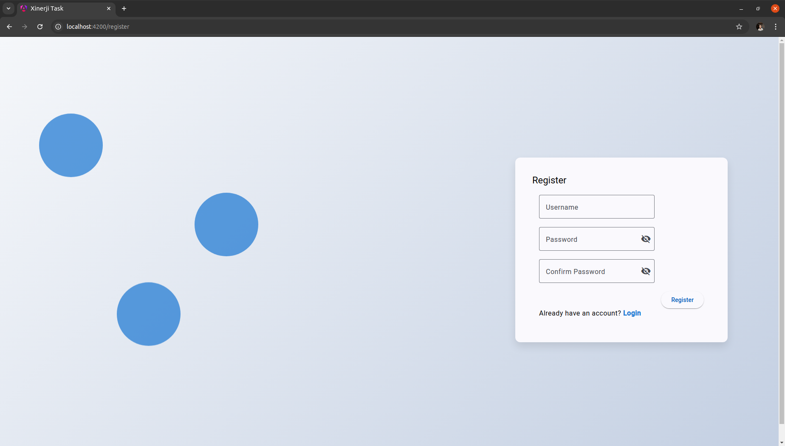

# Login Page Task

A full-stack web application built using Angular for the frontend, Java Spring Boot for the backend, and PostgreSQL as the database. The project includes a user authentication system with secure password hashing, JWT-based authentication, and session management.




## Technologies Used

- **Frontend**: Angular
- **Backend**: Java Spring Boot
- **Database**: PostgreSQL

## Key Features

- User authentication with username and password.
- Error handling for invalid login credentials.
- Secure password hashing in the backend.
- JWT (JSON Web Token) based authentication for secure sessions.
- Logout functionality after successful login.


## Installation Guide

### Prerequisites

Ensure the following tools are installed on your system:

- [Node.js](https://nodejs.org/en/download/)
- [Angular CLI](https://angular.io/cli)
- [Java JDK 11+](https://www.oracle.com/java/technologies/javase-jdk11-downloads.html)
- [PostgreSQL](https://www.postgresql.org/download/)
- [Maven](https://maven.apache.org/install.html)


## Installation

## Backend (Spring Boot) Setup
**Clone the repository:**

```bash
  git clone https://github.com/onuryilmazo/xinerji_task_final.git
```
**Navigate to the project root folder**

```bash
  cd xinerji_task_final
```
**Set up the PostgreSQL database**
- Create a new PostgreSQL database called my_database 
- Restore the database backup from the provided SQL file:
```bash
  psql -U postgres -d my_database < my_database_backup.sql
```
**Configure the database connection in application.properties**
- Update the application.properties file located under src/main/resources with your PostgreSQL credentials:
```bash
  spring.datasource.url=jdbc:postgresql://localhost:5432/my_database
  spring.datasource.username=postgres
  spring.datasource.password=your_password
  spring.jpa.hibernate.ddl-auto=update
```
**Build and run the backend:**
- Run the following commands to build and start the Spring Boot backend:
```bash
  mvn clean install
  mvn spring-boot:run
```
- The backend will be running at http://localhost:8080

## Frontend (Angular) Setup

**Navigate to the frontend folder:**
- Open a new terminal window and navigate to the Angular frontend directory
```bash
  cd frontend-task
```
**Install dependencies**
```bash
  npm install
```
**Run the Angular frontend**
```bash
  ng serve
```

## Running the Application
- **Access the frontend:**: Open your browser and go to http://localhost:4200
- **Login**: Use the provided login credentials or register a new account (depending on the project's setup).
- **Backend API**: The backend API will be accessible at http://localhost:8080

## Notes
- Ensure PostgreSQL is running before starting the backend.
- The JWT-based authentication will be handled between the frontend and backend once the user logs in.

## Troubleshooting

- **Database connection issues**: Double-check the application.properties file to ensure the correct database URL, username, and password are set
- **Angular build issues**: Run npm install to ensure all dependencies are correctly installed
- **Port conflicts**: Ensure no other services are running on ports 4200 (for Angular) or 8080 (for Spring Boot)

